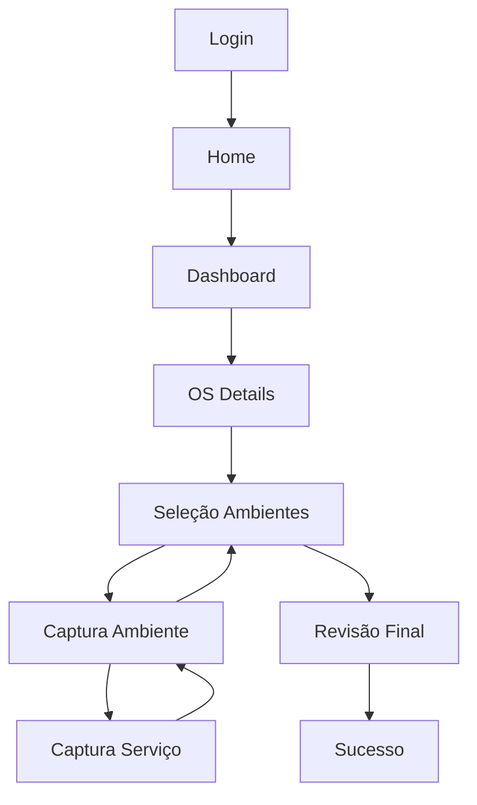

# FLUXOS.md

## 1. Jornada Principal (Happy Path)
1. **Login**: Técnico acessa com usuário/senha.
2. **Dashboard**: Seleciona uma OS com status "Pendente".
3. **Setup OS**: Confirma dados do local e insere sua matrícula.
4. **Seleção de Ambientes**: Escolhe os ambientes que existem fisicamente no local.
5. **Captura Macro**: Tira fotos de vista ampla de um ambiente.
6. **Registro de Serviço**: Adiciona um serviço (ex: Pintura), tira fotos gerais e fotos de detalhes.
7. **Validação Ambiente**: Salva o ambiente após garantir que há serviços documentados.
8. **Revisão**: Confere se todos os ambientes planejados foram capturados.
9. **Finalização**: Envia o levantamento e recebe confirmação.

---

## 2. Fluxos Alternativos
- **Adição de Ambiente não Listado**: Durante a seleção, o técnico percebe um ambiente novo -> Abre modal -> Digita nome -> Ambiente aparece na lista para captura.
- **Continuar Levantamento**: Técnico inicia uma OS, sai do app, e retorna depois -> App abre no Dashboard com status "Em Andamento" -> Técnico retoma de onde parou.
- **Edição de Captura**: Após capturar um serviço, o técnico nota que a foto ficou borrada -> Volta na tela de captura do serviço -> Remove a foto antiga -> Captura nova.

---

## 3. Tratamento de Erros e Edge Cases
- **Ambiente sem Serviço**: Usuário tenta salvar ambiente sem adicionar serviços -> Sistema exibe badge de erro e bloqueia botão "Salvar Ambiente".
- **Serviço sem Foto de Detalhe**: Usuário tenta concluir serviço sem a evidência macro necessária -> Sistema bloqueia botão "Concluir Serviço".
- **Término Prematuro**: Usuário tenta enviar o levantamento completo com ambientes pendentes -> ReviewScreen exibe alerta vermelho e bloqueia "Enviar".
- **Queda de Conexão (Predição)**: O sistema deve permitir a captura offline e sincronizar apenas no SuccessScreen (ou via background sync).

---

## 4. Diagrama Lógico (Mermaid)

